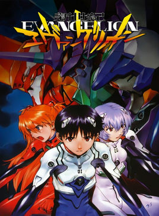

# EVA

## Neon Genesis Evangelion 新世纪福音战士
全称其实上面这个，还记得大妈的title是CEO吗？而E是Evangelion，而不是Executive噢~所以第一篇当然是提EVA，这个古老的话题。

具体资料请[百度](http://baike.baidu.com/subview/19350/9229059.htm)

### 先提几点内容外的：
* 1995年制作，到今年正好20年了，然而粉丝仍然众多
* 常年保持Blueray-DVD销量第一，这都已经多少年了啊没人超越
* 于是简称**世纪坑钱计划**
* 但是粉丝就是想买买买。。。

### 再来说说为啥喜欢它
* 第一次看是小学时候在电视上看的（那时候的电视多开放啊啥都有），有配音还有主题曲都是“勇敢的少年呀快去创造奇迹”，相传是鞠萍姐姐唱的。那时的自己就是个电视儿童，就喜欢抱着电视看，从小神龙俱乐部到倚天屠龙记，什么都可以看。而EVA就是在偶然的换台中看到，然后就是单纯觉得挺好看的，怀着“后面会发生什么呢？”的想法准点守着看。结果某一次突然怎么等也等不到播放了，一连等了好多天，再也没能看到。一时失落了好久。那时又没有网络，连名字都没记住，只以为每天准点守着就肯定看得到。
* 所谓念念不忘，必有回响。虽然在后来的很多年里，没有想它，把它放在了某个角落。但在以后突然重遇的时候，所有的记忆就全部复苏了。虽然剧情已经不会想起来了，但是第一次看的时候那种感受以及某几个画面却很好的保存下来并继续影响着自己的某些品味。
* 小时候第一次看的时候印象最深刻的画面就是真嗣老是在听随身听，一个人坐在空荡荡的列车里。那个时候的我看不懂这些画面到底是为什么，但是画面配合BGM本身给人的冲击力已经足够我一直放在大脑记忆深处。
* 还有女神绫波丽，真的没什么台词，那个时候我一直以为是个爱情故事，所以很想看女神和真嗣的互动，但每次都觉得很冷很冷。两个人几乎无法沟通流畅，但又似乎有某种羁绊，让我觉得他们一定是有某种联系的。
* 其实吧，现在喜欢一部作品的原因现在可以说出很多，类似“XX片段很感动”“很搞笑”“故事讲得好”等等。。。但你要说为什么喜欢EVA，就我个人而言不知道挺难用自己已有的评价体系去描述。