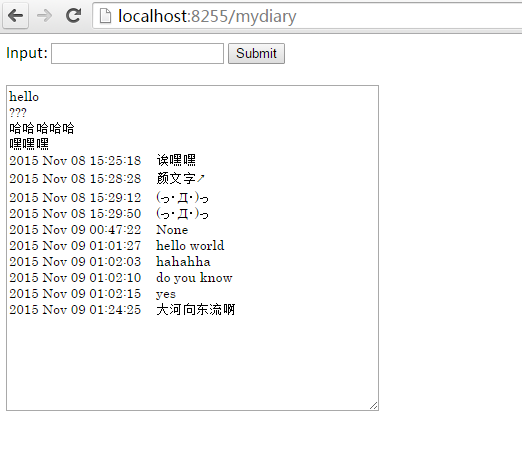

## 介绍
web内网版笔记系统,可以通过网页或命令行访问,读取旧日记及写入新日记.

## 使用
### 网页版
* 下载main.py bottle.py diaryweb.tpl至同一目录下
* 终端```cd 下载路径```
* ```python main.py```
<<<<<<< HEAD
* 浏览器打开http://localhost:855/mydiary
=======
* 浏览器打开http://localhost:8255/mydiary
>>>>>>> 118a92e623a0ba0c5c71fe33d4812529146d4aa5



### 命令行
* 下载client.py
* 第二个终端```cd 下载路径```
* ```python client.py```


