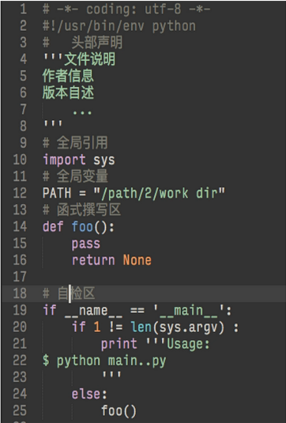

# 1wd4

### 表扬
~ wp-lai: taobao搜索

~ aJiea: 表述创新

~ Zoe: 教程人性化，第二人称

### C2T2
~ 广州
~ 深圳
~ 北京
~ 珠海


# CLI 编程思想的具象

* 现实生活
	* 日常
* 远程
* 自动化
* 批量
* 管道

## CLI 命令行
* GUI 为了给人看的图片和设计等
* CLI 是本源，二进制世界
* API 数据接口，把数据公开到互联网上，通过命令行去操作数据
* 命令行->理性的浓度

## REPL 交互环境
* 输入->运行->输出->循环
* ```dir()```
* ```help()```
* ```ipyhon```
* ```Pyenv```

##Task
任务完成基准点

* 展示
	* 输入 ？/h/help 打印帮助
	* 输入 q/quit 退出
* 期待
	* 直觉的无参数调用
	* 直觉的默认帮助
	* 持续的输入
	* 直觉的退出
	* 自动保存
* 技术
	* raw_input()
	* while + break
	* os.path.exists（日志文本是否存在，可能会出错）
	* open()
	* for.. in
	* 少于51行

### Coding MyDiary
* 交互性

## DOC 官方文档
* 官方文档可以下载到本地，rST格式要编译，教程和库说明
* tips
	* 有任何问题print出来，再看官方文档

## UTF-8
* ASCII 128个字符
* Unicode 100多种字符集 16bit
* UTF-8 编码 2-4bit，已是主流


## 搜索
* google
	* 快照 woodpecker
	
## 八股式框架
* 自检区，总调用入口
* 只是引用，不会触发运行


## pythonic 范儿
pythonista八荣八耻
> 以动手实践为荣，以只看不练为耻。  
> 以打印日志为荣，以单步跟踪为耻。  
> 以空格缩进为荣，以制表分隔为耻;  
> 以单元测试为荣，以手工测试为耻。  
> 以代码重用为荣，以复制粘贴为耻。  
> 以多态应用为荣，以分支判断为耻。  
> 以Pythonic为荣，以冗余拖沓为耻。  
> 以总结分享为荣，以跪求其解为耻。  

## 2w任务
* 桌面应用**Tk**inter python内置的包装，gui组建集，很小，实时控制有很多应用
* 怎么把1w的任务copy过来？

##PS:
所有东西都能教授，但！**求知欲**和**学习能力**除外