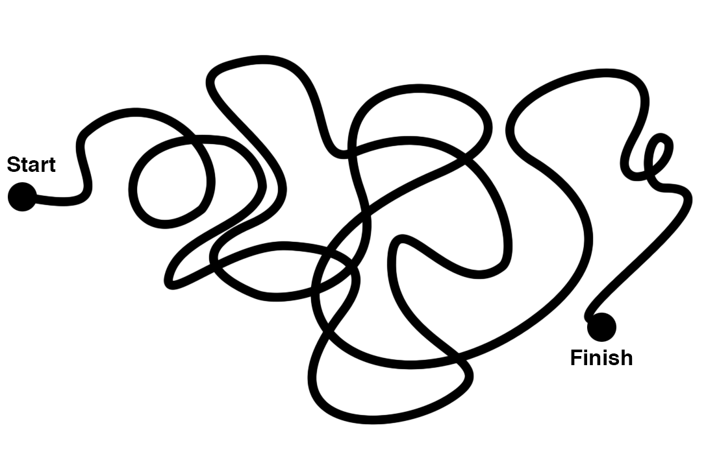
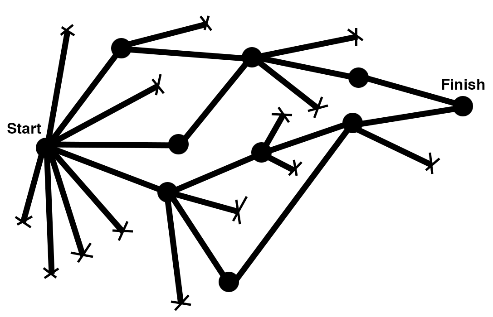

# 6wd4

* 还是补个简短的笔记吧.....

## 被夸当然心情棒棒哒
* 很遗憾终于被夸了,结果上周出门玩了没看到直播.....
* 解释一下我的github账号是bambooom = bamboo + boom, bamboo=竹子<-这个才是本体啦!boom或者booom或者boooom是非常偶然特质XD
* 有关google的原创体验, 嗯~的确是我原创,但也不算是从python班才开始的,这个也算是经验积累了很久的体会吧~

## 其实6wd4唯一印象较深的是牛人与挫人的区别
> 牛人是路径依赖
> 挫人是习得性无助

* 感觉挫人说的挺在点的,牛人的话,各有各的牛逼之处,有些大概不能完全一概而论~
* 但是个人非常相信一句话,```没有调查就没有发言权```
* 所以自己连google一下关键词这一步都不做就马上发出问题的, 在我看来都有点不能忍
* 偶尔就算和朋友聊天遇上一些不知道在谈的人或者事是什么的时候,我都会习惯性先搜一下,确定无法从google上马上获得基础背景知识,再出声询问朋友
	* 一个小事情, 在大学同学的微信群里, 已经有不下20个人问过同样一个问题, 有的时候看到也会很恼火, 你可以先google或者百度一下吗?或者搜下微信聊天记录也好啊......
	* 还有一次, 竟然有人问自己的一个什么亲戚什么什么样的学校什么什么样的成绩申请某某大学的研究生有希望吗? 日了狗了, 大学研究生基本招生标准一般网上都写的清清楚楚, 能让您亲戚亲自去网上看看吗?为啥要在同学的微信群里问???
	* 说偏了....
* 总之, 我觉得我自己的确是有不爱问问题不会问问题的问题, 但是张口就随便问,不过脑的问问题就是习得性无助, 好像什么东西都应该有其他人可以帮你解决一样, 很是低能(抱歉用这种词)


* 有关牛人, 正好前两天在Quora上看到一个问答[What differentiates a "senior" programmer from a "regular" programmer?](https://www.quora.com/What-differentiates-a-senior-programmer-from-a-regular-programmer/answer/Aziz-Ali)
* 答案中有一组对比图比较有意思, 图源出自[此处](https://medium.com/the-year-of-the-looking-glass/junior-designers-vs-senior-designers-fbe483d3b51e#.mjo7amyel)
* 这是一个Junior developer怎样解决问题  

* 这是一个Senior developer怎样解决问题  


* 大致翻译下这个Quora回答说了三点:
	* 高手的经验丰富,所以面对挑战是有曾经面对或类似的经验可以复用,而普通人会觉得完全陌生的新问题而焦虑或担忧
	* 对于困难的解决路径就如图所示. 高手是通过不断的小测试而找到解决问题的路径,而普通人则是碰运气式的尝试. 高手的解决路径是有逻辑可循的,就像做科学实验一样,验证猜想并将每个小结果连接起来最终得到结论.
	* 拥抱可能性. 普通人是固化思维, 只会运用已有的知识架构去思考问题. 而高手是会发散性思维, 找到更优解.
* 除了这个回答, 下面的评论中, 还有人提到有些人会不愿意抛弃错误的idea, 一旦写了的code就不愿意delete哪怕离目标差的很远.


## 疑问
* 如何找到自己的路径依赖?
* 学习学习再学习


## Changelog
20151205 创建编辑


